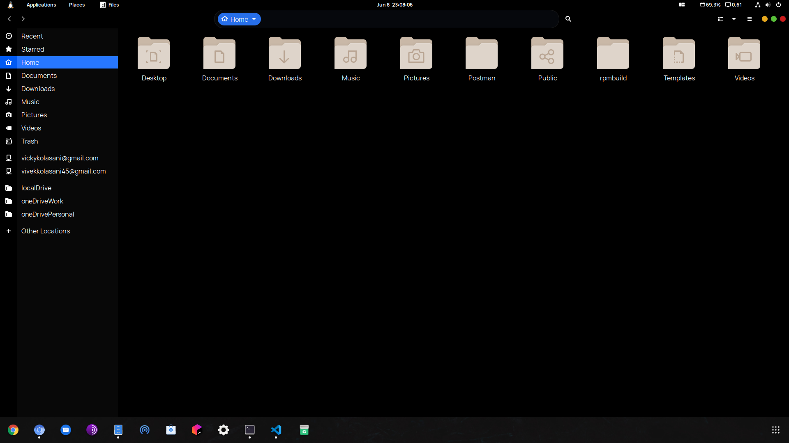

# Dhriti

## About

Dhriti is a A custom GTK and GNOME shell theme, based on [Flat Remix](https://github.com/daniruiz/flat-remix) by daniruiz. It uses base adwaita icons by default.



## Installation

1. Clone or Download the repository.

   ```bash
       git clone https://github.com/devkolasani/dhriti
   ```

2. Run the Install script in the repository.

   ```bash
       sh install.sh
   ```

## Usage

Use the [Gnome tweak tool](https://wiki.gnome.org/Apps/GnomeTweakTool) to set shell and gtk themes to dhriti.
